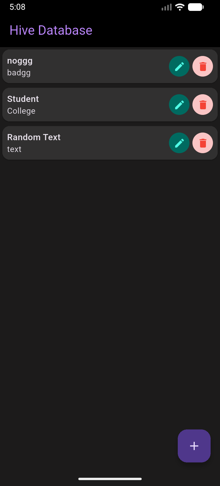
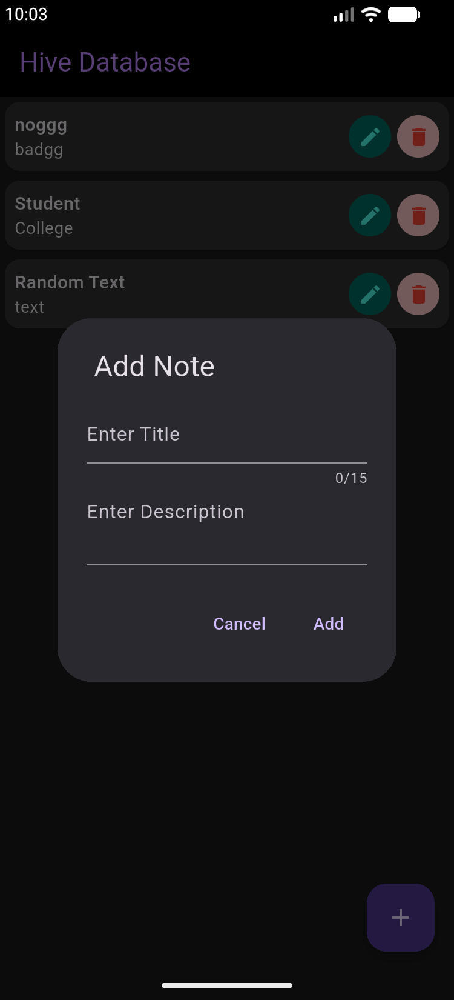

# Notes App with Hive Database

A Flutter Notes Application built using Hive Local Database. This project demonstrates how to perform CRUD (Create, Read, Update, Delete) operations using Hive and display real-time updates in the UI.

## Features

* Create Notes
* View Notes
* Update Notes
* Delete Notes
* Real-time UI updates using ValueListenableBuilder
* Dark Theme UI
* Local data persistence with Hive
* Text overflow handling
* Dialog-based note management

## Technologies Used

* Flutter
* Dart
* Hive Database
* Hive Flutter
* ValueListenableBuilder

## Project Structure

```text
lib/
├── boxes/
│   └── box1.dart
├── Models/
│   ├── notes_model.dart
│   └── notes_model.g.dart
├── homeScreen.dart
└── main.dart
```

## Screenshots

### Home Screen



### Add Note Dialog




## Learning Outcomes

Through this project I learned:

* Hive local database integration
* Hive TypeAdapter generation
* CRUD operations using Hive
* Data persistence in Flutter
* Real-time UI updates with ValueListenableBuilder
* Dialog and form handling

## Installation

1. Clone the repository

```bash
git clone https://github.com/aamir-14/Notes-App-with-Hive-Database.git
```

2. Navigate to the project

```bash
cd notes_app_with_hive
```

3. Install dependencies

```bash
flutter pub get
```

4. Run the application

```bash
flutter run
```

## Author

Muhammad Aamir Iqbal

- BS Information Technology Student
- Junior Flutter Developer
- Flutter & Mobile App Development Enthusiast